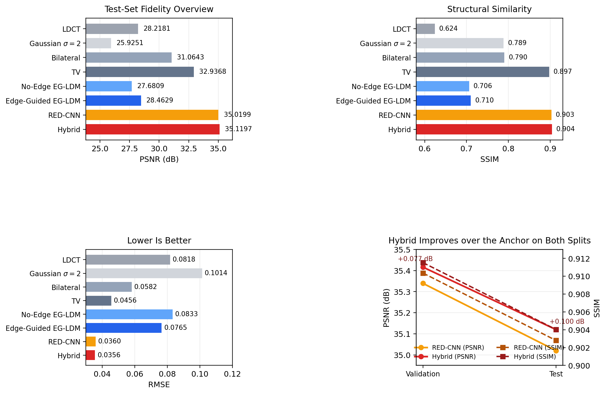
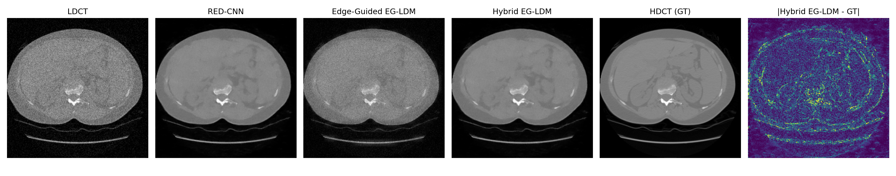
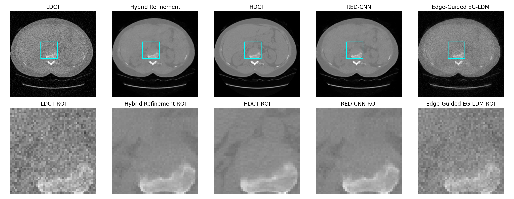

# Anatomically Consistent Low-Dose CT Denoising

Hybrid edge-guided diffusion refinement for leakage-free low-dose CT denoising on LIDC-IDRI.

[Paper PDF](paper/neurips_2024.pdf) | [Presentation](presentation/ldct_hybrid_egldm_3min_presentation.pptx) | [Experiment Summary](docs/RESULTS.md) | [GitHub Repository](https://github.com/LordTARN1SHED/Anatomically-Consistent-Low-Dose-CT-Denoising)

> This repository contains the paper companion package for our final project on low-dose CT denoising.  
> The key result is that diffusion works best here as a conservative anatomical refiner around a strong RED-CNN anchor, rather than as a standalone denoiser.

## Overview

Low-dose CT denoising is a high-stakes restoration problem: removing noise is useful only if the method does not invent unsupported anatomy. In this project, we build a leakage-free patient-level benchmark on raw LIDC-IDRI DICOM and study a hybrid denoising pipeline that combines:

- a strong RED-CNN anchor for pixel fidelity
- an edge-guided latent diffusion refiner
- 2.5D neighboring-slice conditioning
- conservative anchor-aware and edge-adaptive fusion at inference

The final system, **Hybrid EG-LDM**, slightly outperforms the RED-CNN anchor on the held-out test split under the reported medium-scale protocol.

## Main Result

Under the real-data test protocol:

| Method | PSNR | SSIM | RMSE |
| --- | ---: | ---: | ---: |
| LDCT | 28.2181 | 0.6244 | 0.08176 |
| RED-CNN | 35.0199 | 0.9028 | 0.03598 |
| No-Edge EG-LDM | 27.6809 | 0.7063 | 0.08328 |
| Edge-Guided EG-LDM | 28.4629 | 0.7102 | 0.07652 |
| **Hybrid EG-LDM** | **35.1197** | **0.9040** | **0.03558** |

Relative to the RED-CNN anchor, Hybrid EG-LDM improves:

- `PSNR +0.0998`
- `SSIM +0.00123`
- `RMSE -0.00040`

See [docs/RESULTS.md](docs/RESULTS.md) and [results/summaries/hybrid_refinement_summary.md](results/summaries/hybrid_refinement_summary.md) for the full result summary.

## Figures

### Quantitative Overview



### Qualitative Comparison



### ROI Zoom



## What Is In This Repository

This package is designed to be public GitHub friendly. It includes:

- paper source and compiled PDF
- core code, scripts, and configs
- patient-level split metadata
- curated metrics, figures, logs, and summaries
- a release-compatible baseline checkpoint: `results/checkpoints/redcnn_best.pt`
- a short conference-style presentation and script

It intentionally excludes:

- raw LIDC-IDRI DICOM data
- large cached tensors and full prediction dumps
- the large hybrid training checkpoint that exceeds standard GitHub file limits

## Repository Layout

```text
code/         source code, scripts, and YAML configs
docs/         environment, data prep, experiments, and result notes
metadata/     patient split metadata and raw-data placement note
paper/        NeurIPS-style paper source, figures, and PDF
presentation/ short presentation deck and talk script
results/      metrics, figures, logs, summaries, and public-size checkpoint
```

## Quick Start

### 1. Environment

```bash
pip install -r requirements.txt
```

See [docs/ENVIRONMENT.md](docs/ENVIRONMENT.md) for environment details.

### 2. Prepare Data

Raw LIDC-IDRI data is **not** included in this repository. Place the raw data as described in:

- [docs/DATA_PREPARATION.md](docs/DATA_PREPARATION.md)
- [metadata/lidc_raw/README.md](metadata/lidc_raw/README.md)

### 3. Build the leakage-free patient split

```bash
python code/scripts/prepare_lidc.py --config code/configs/train_lidc_medium.yaml
```

### 4. Train the RED-CNN anchor

```bash
python code/scripts/train_redcnn.py --config code/configs/train_redcnn_medium.yaml
```

### 5. Train the hybrid diffusion model

```bash
python code/scripts/train_controlnet.py --config code/configs/train_lidc_hybrid_medium.yaml
```

### 6. Evaluate the best hybrid configuration

```bash
python code/scripts/evaluate.py --config code/configs/eval_lidc_hybrid_medium_test_best.yaml
```

For the complete command list, see [docs/EXPERIMENTS.md](docs/EXPERIMENTS.md).

## Reproducibility Notes

- The benchmark uses **patient-level** train/val/test partitions.
- The split metadata is included in:
  - [metadata/lidc_index/patient_splits.json](metadata/lidc_index/patient_splits.json)
  - [metadata/lidc_index/split_manifest.json](metadata/lidc_index/split_manifest.json)
- The reported real-data metrics are included in:
  - [results/metrics/hybrid_test_best_metrics.json](results/metrics/hybrid_test_best_metrics.json)
  - [results/metrics/redcnn_test_metrics.json](results/metrics/redcnn_test_metrics.json)
  - [results/metrics/edge_guided_ldm_test_metrics.json](results/metrics/edge_guided_ldm_test_metrics.json)
  - [results/metrics/no_edge_ldm_test_metrics.json](results/metrics/no_edge_ldm_test_metrics.json)

## Paper and Presentation

- Paper source: [paper/neurips_2024.tex](paper/neurips_2024.tex)
- Paper PDF: [paper/neurips_2024.pdf](paper/neurips_2024.pdf)
- Slides: [presentation/ldct_hybrid_egldm_3min_presentation.pptx](presentation/ldct_hybrid_egldm_3min_presentation.pptx)
- Script: [presentation/ldct_hybrid_egldm_3min_script.txt](presentation/ldct_hybrid_egldm_3min_script.txt)

## Recommended Reading Order

If you are new to the repository, start here:

1. [docs/MANIFEST.md](docs/MANIFEST.md)
2. [docs/RESULTS.md](docs/RESULTS.md)
3. [docs/EXPERIMENTS.md](docs/EXPERIMENTS.md)
4. [paper/neurips_2024.pdf](paper/neurips_2024.pdf)

## Pre-Publication Note

Before making this repository fully public, choose an explicit open-source license and replace [LICENSE_PENDING.md](LICENSE_PENDING.md) with the final `LICENSE` file.
